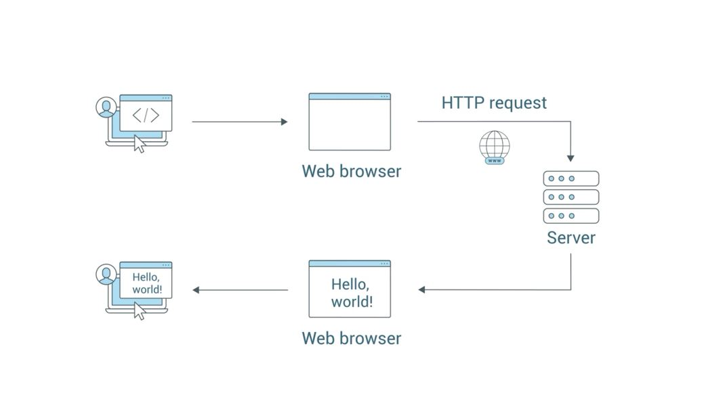
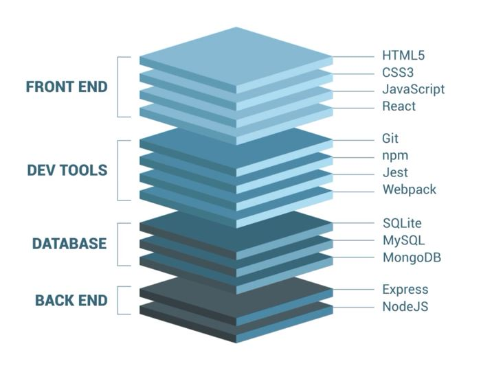
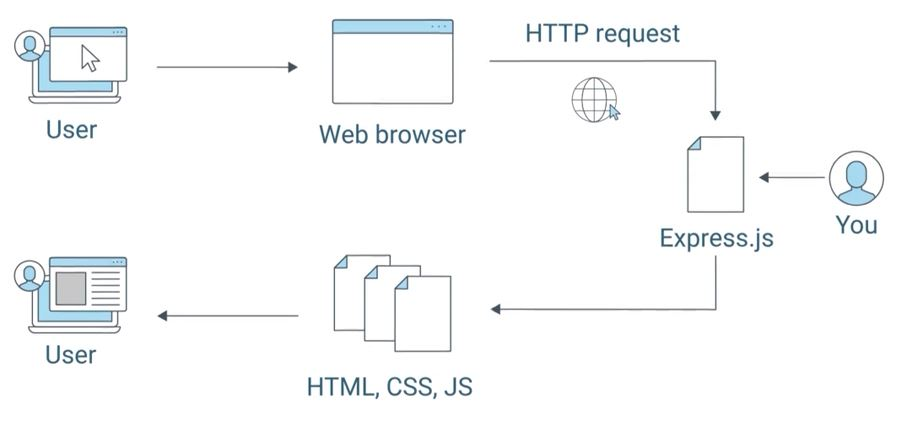
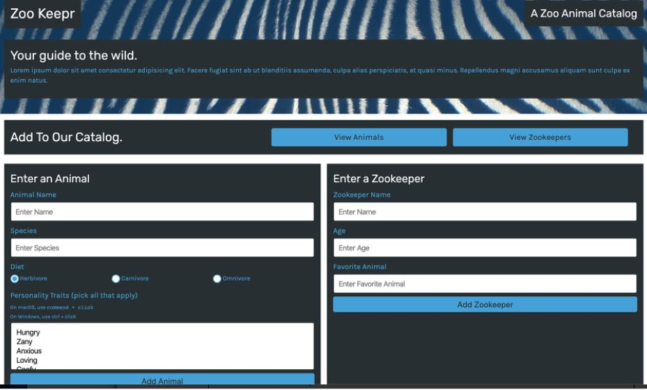
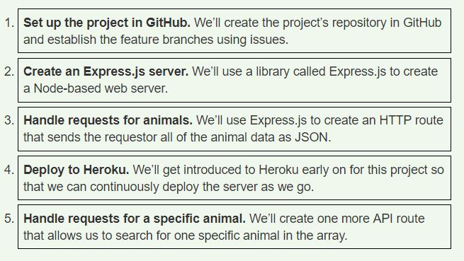
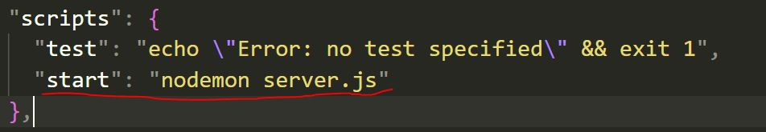
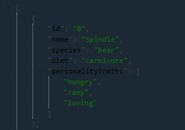
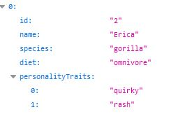
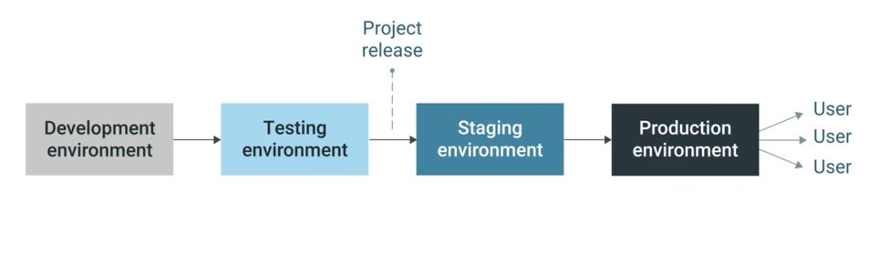

# EXPRESS JS

* This module will explain how to create your own server side API using EXPRESS J.S framework.
* EXPRESS allow quick and easy API route & associated HTTP request methods.
* Routing is how we handle server response whenc client makes a request.

## Brief about SERVER

*  A server is a piece of computer hardware or software (computer program) that provides functionality for other programs or devices, called "clients". 

### client server side relation deoicts in the image below



## What we learn from this project 

* how to handle client request
* returning responses
* how to handle errors
* what happens when a user submit a web form



# zoo keepr
* this module will create a web server using Express.js and add it to the front end that a local zoo developing
* we will deploy this site to HEROKU-a clound application platform that allow you to deploy application with servers to a webpage.

## project Brief
### our local zoo is moving to the cloud. They want to move there filing cabinet data to cloud digital information management. This allow Zoo managemnt to work more effectively and also allow educational details to public online.

## To Do List for the ZOO kepr

* create front end: HTML and CSS
* create a data base
* create back end: handle data management



## tools needed
* Express.js is a minimal and flexible Node.js web application framework that provides a robust set of features for web and mobile applications. It is considered the de facto standard server framework for Node.js.

* Insomnia Core is a powerful REST API client that allows us to test APIs and make client-side server requests without having to use a browser.

* Heroku https://www.heroku.com/  is a cloud application platform that enables developers to build, run, and operate applications entirely in the cloud. Unlike GitHub pages, which only allows you to deploy static sites with HTML pages, Heroku allows you to deploy a server.js file that will run the Node.js process. You’ll also use the Heroku CLI https://devcenter.heroku.com/articles/heroku-cli, which will help you deploy apps easily without leaving the command line.

## lesson objective
 ### By this project we will learn how to do the followings,
 * setup and run a Node.js web server using Express.js
 * handle two types of GET request using parameters
 * make the application production-ready and deploy it on Heroku.

 

 ## project steps depicted below

  

  # start project 

  ## add github issue

  ## issue 1 - Create a web server

  * As a user, I can request for a list of all animal data

  * As a user, I can request data for just one animal based on its id value

  * As a user, I want to be able to do this from anywhere and not just my computer


 ## issue 2 - Allow user creation of data

 *  As a user, I want to be able to add a new animal to the catalog

## issue 3 - Implement Front End

* As a user, I want to be able to view data from the server in a front-end web application

* As a user, I want to create new data by submitting an HTML form

## issue 4 - Incorporate a seperate dataset

* As a user, I want to be able to access and create different types of data stored on the server

# create project files

* A json data from the zoo is stored in the folder **[animal.json](data/animal.json)**.

* Created root project directory **[server.js](server.js)**.

#  Working of Express.js and why we are using it on our project

* Whenever we need to retrive a data from an API, we would make a request to an endpoint and wait until we get get the response back from server to client. Express follow the same pattern.
* Node.js application are not considered as a servers. To be considered as sever, a machine/program needs to provide some functionality to a client. in our case, we want that functionality to be accepting a request and send back a response.
* Node.js servers require significant more code that using Express.js 

# installing node and dependencies 

* **npm init** - ask preliminary details about our project and create a own json file.
* **npm i express --save** - will install express.js to our project **--save** will add the dependency as development dependency.


#  zoo keepr starts here

* we need to require the npm package express on our **[server.js](server.js)**
* also we assign **express()** to the **app** variable so that we can chain on methods to express.js server later.
* a **[listen(port)](https://expressjs.com/en/api.html#app.listen)** method is added at the end to run code on specified port.
* to run server **npm start** on terminal.

## what is a **port**?

* port gives website address an exact location/destination on the host.
* most common ports are **80 (http://)** sites and **443 (https://)**.
* port with number **1024** and under are considered by special operating system, and often need permission to use(like running the process as an administrator).
* to avoid the these permission restriction we choose to run ports with less restriction such as any between **1024** and **49151!** can be used, but we choose number **3000**   because it is common practice and easy to remember.

## Handle request for animal

* create a route that the front end can request data from.
  ````
  const { animals } = require('./data/animals');
  
  
 **[Listenport:3001](http://localhost:3000/api/animals)**

* followed by
  ```
  app.get('/api/animals', (req, res) => {
  res.send('Hello!');});

* there is two important things from the code above:
1. the **get()** method require two arguments.
    - a string that will describe the route the client will have to fetch from.
    - is a callback function that will execute everytime that route is accesed by a **GET** request.

2. we are using the **send()** method from the **res** parameter(short for response) to send the string "Heloo!" to client. [more information on res method](https://expressjs.com/en/api.html#res).

## how to start and stop server.
  * **npm start** to start the server
  * **ctrl+c** and the **Y** to stop the server.
  * we could use **[nodemon](https://www.npmjs.com/package/nodemon)** npm package to automatically restart the node application when file changes in the directory are detected.
    - to install nodemon **npm i nodemon -g** here we are installtion the dependency as global **-g**.
    - followed by we have to change our [package.json](package.json) **start** command to **"start":"nodemon server.js"**.


    

* the **send()** method is normally used for sending short messages, but what to use for the **json** data that we have got from our project data?
to send **JSON** just change **send** to **json**.
```` 
app.get('/api/animals', (req, res) => {
  res.json(animals);
});
````

*  **[Listenport:3001 after](http://localhost:3000/api/animals)** you see the some thing like this:


  


* the JSON data appears, we have a working server.

* we use **filterByQuery()** method to filter the data we need from the big data JSON.

````
app.get('/api/animals', (req, res) => {
  let results = animals;
  console.log(req.query)
  res.json(results);
});
````

http://localhost:3001/api/animals?name=Erica

* You see 


* it has taken **query parameter** and turned into **JSON**
* whatever query paarmeter you use on URL will become JSON, 
    - example: **?a=111&b=222&c=333** will become,
      ````
      {
        a: "111",
        b: "222",
        c: "333"
      }
      ````

* **IMPORTANT** if we add same query name with different values, it will become **array** in **JSON**
    - example: **?a=111&b=222&b=333** will become,
      ````
      {
        a: "111",
        b: ["222","333"]
        
      }
      ````

* now we add filter functionality inside the **.get()** callback, we are going to break it out inot its own function. This will make the code look cleaner.
* Above the **.get()**, create a new function called **filterByQuery()** by adding following code,

````
function filterByQuery(query, animalsArray) {
  let filteredResults = animalsArray;
  if (query.diet) {
    filteredResults = filteredResults.filter(animal => animal.diet === query.diet);
  }
  if (query.species) {
    filteredResults = filteredResults.filter(animal => animal.species === query.species);
  }
  if (query.name) {
    filteredResults = filteredResults.filter(animal => animal.name === query.name);
  }
  return filteredResults;
}
````

* this function will take a request query **res.query** as an argument and filter throught the animal accordigily.
* we can now call the **filteredByQuery()** in the **app.get()** callback as shown in the following code:

````
app.get('/api/animals', (req, res) => {
  let results = animals;
  if (req.query) {
    results = filterByQuery(req.query, results);
  }
  res.json(results);
});

````
* now we run the server with this query http://localhost:3001/api/animals?name=Erica we see,

 

* Now this code is capable of quering through strings but we need to update code to function for the arrays such as **personality traits** data.

````
function filterByQuery(query, animalsArray) {
  let personalityTraitsArray = [];
  // Note that we save the animalsArray as filteredResults here:
  let filteredResults = animalsArray;
  if (query.personalityTraits) {
    // Save personalityTraits as a dedicated array.
    // If personalityTraits is a string, place it into a new array and save.
    if (typeof query.personalityTraits === 'string') {
      personalityTraitsArray = [query.personalityTraits];
    } else {
      personalityTraitsArray = query.personalityTraits;
    }
    // Loop through each trait in the personalityTraits array:
    personalityTraitsArray.forEach(trait => {
      // Check the trait against each animal in the filteredResults array.
      // Remember, it is initially a copy of the animalsArray,
      // but here we're updating it for each trait in the .forEach() loop.
      // For each trait being targeted by the filter, the filteredResults
      // array will then contain only the entries that contain the trait,
      // so at the end we'll have an array of animals that have every one 
      // of the traits when the .forEach() loop is finished.
      filteredResults = filteredResults.filter(
        animal => animal.personalityTraits.indexOf(trait) !== -1
      );
    });
  }
  if (query.diet) {
    filteredResults = filteredResults.filter(animal => animal.diet === query.diet);
  }
  if (query.species) {
    filteredResults = filteredResults.filter(animal => animal.species === query.species);
  }
  if (query.name) {
    filteredResults = filteredResults.filter(animal => animal.name === query.name);
  }
  // return the filtered results:
  return filteredResults;
}

````
http://localhost:3001/api/animals?personalityTraits=hungry


http://localhost:3001/api/animals?personalityTraits=hungry&personalityTraits=zany


# Deploy to Heroku

* GitHub pages only deploy static sites made of HTML.
* here we need to deploy a [server.js](server.js) file run as **Node.js** process.
* So we use HEROKU

* create an account on heroku [click here](https://signup.heroku.com/login) .
* then download heroku CLI [click here](https://devcenter.heroku.com/articles/heroku-cli)
* recommend to restart system after CLI install.

* create a heroku application type **heroku create** on terminal
* can specify the file directory(application name) by **heroku create <app name>**
* since heroku dont work or take file from sub braches of git, so we have to push our working files to heroku main.
* we can add files to heroku by:
  ````
  git add -A
  git commit -m "Add Heroku"
  git push heroku feature/MVP: main 

  ````

* heroku will provide a link of deployed application after the push.
* before we click link we have to specify the port as heroku will only deploy on port 80.
* to specify port by heroku and to use it if available we have to write to mention code;
````
const PORT =  process.env.PORT || 30001;
<!-- which says use the port as the port mentioned by heroku ie. 80 if not available use 3001 port -->

app.listen(PORT, =>{
  console.log( `API server now on port ${PORT}`);
})
````
# Difference between development(local) and production(Heroku) enviroment


* a **development environment** is where we:
  - code new feature
  - fix bugs
  - make all our code updates
* when we say development environment we are referring to what stored on our local machine.
* **production environment** where our live application lives
* example such as;
  - github pages
  - heroku
  - microsoft azure
  - aws
* a **production environment** is where:
  - Hosts the update and tested version of code.
  - accessible to the users
  - every code is ensured functionality at development environment before movibg to production evironment.
* production environment have its own database and it wouldn't be connected or affected by our local/development database. 

| Local development environment      | production development environment     |
| :------------- | :----------: 
|  New Code | cloud-hosted   | 
| Features  | seperate from your local environment |
|  BUg fixes |

* most companies have a additional environment before production after development ie. staging environment
* staging environment

  


  - Replica of the production environment
  - helps test changes in the local env.
  - Provides additional layer of QA.


* **[req.params](https://www.geeksforgeeks.org/express-js-req-params-property/)**- 
params. An object containing parameter values parsed from the URL path. For example if you have the route /user/:name , then the "name" from the URL path wil be available as req.params.name .

* **[req.param.ID](https://www.geeksforgeeks.org/express-js-req-params-property/)** - The req. params property is an object containing properties mapped to the named route “parameters”. For example, if you have the route /student/:id, then the “id” property is available as req.params.id. This object defaults to {}.


| req.query      | req.param  |
| :------------- | :----------: 
|  is multifaceted | single property   | 
| often combaning multiple parameters | often intended to retrive a single record |


